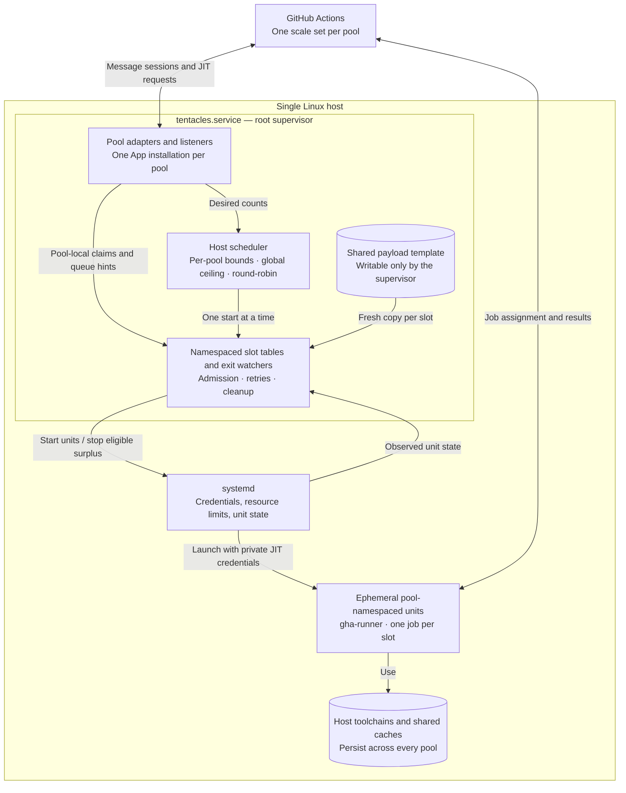
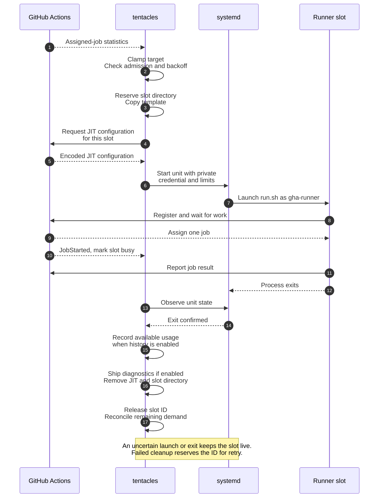

# tentacles

`tentacles` is a single-host supervisor for GitHub Actions runners. One
process authenticates one or more GitHub App installations and owns one
runner scale set per configured pool through
[`github.com/actions/scaleset`](https://github.com/actions/scaleset). It
starts official [`actions/runner`](https://github.com/actions/runner)
processes with just-in-time (JIT) configuration. Every process is a one-job
slot: after confirmed process exit, the daemon removes the slot directory,
its work folder, and JIT files. Failed cleanup retains the pool-local slot ID
for retry; each new slot starts from a fresh copy of the shared payload.

No Docker, no microVMs, no Kubernetes, no `config.sh`, no `svc.sh`, no
inbound webhooks.

Contents:

1. [Security warning](#security-warning)
2. [How it works](#how-it-works)
3. [Quickstart](#quickstart)
4. [Configuration](#configuration)
5. [Scaling semantics](#scaling-semantics)
6. [Payload and slot lifecycle](#payload-and-slot-lifecycle)
7. [Observability](#observability)
8. [systemd integration](#systemd-integration)
9. [Failure modes and troubleshooting](#failure-modes-and-troubleshooting)
10. [Upgrades](#upgrades)
11. [Development](#development)
12. [Known limitations](#known-limitations)
13. [Acceptance criteria](#acceptance-criteria)

## Security warning

> **This is not job isolation.** Jobs from every configured pool run as the
> same `gha-runner` Unix user directly on the host, with shared toolchains,
> caches, kernel, and network. Anyone who can queue a workflow targeting any
> pool can run code on this machine and affect later jobs from another pool.
> Restrict each runner group to selected repositories, and configure only
> organizations inside the same trust domain.

If organizations cannot trust each other's workloads, use separate hosts,
VMs, or an isolated runner system instead.

## How it works

The production backend separates the root supervisor from the unprivileged
runner units. GitHub supplies demand and assigns jobs; the daemon manages
local capacity and each runner's lifetime.



Runner units remain independent of `tentacles.service`, so a supervisor
restart can adopt surviving jobs within their pool namespace. Each slot gets
its own work directory; jobs still share the runner UID, host toolchains, and
caches across pools.

- Each pool has one upstream listener. Its
  `statistics.TotalAssignedJobs` supplies that pool's desired count. Job
  lifecycle messages affect only the matching pool.
- Pool demand is clamped to `pools[].capacity.min_runners` and
  `pools[].capacity.max_runners`. The host scheduler then allocates available
  slots round-robin without starting above `capacity.max_runners`. Busy
  runners are preserved even when demand falls.
- A slot is a `systemd-run` transient unit named
  `tentacle-<pool>-<id>.service`. Its state, diagnostics, and JIT source are
  rooted under pool-qualified directories. The root supervisor writes a
  `0600` JIT source; systemd `LoadCredential` delivers a private copy to the
  job unit. The shell supplies `--jitconfig` to the official runner. The value
  remains visible in process arguments for the lifetime of `run.sh`; keep this
  host restricted to trusted workloads and administrators.
- Workflows target the scale-set name, not `self-hosted`:

  ```yaml
  jobs:
    test:
      runs-on: debian-host
  ```

Slot lifecycle states are `starting` (provisioning), `idle` (launch completed,
no JobStarted seen), `busy` (claimed, adopted, or launch outcome uncertain),
and `stopping` (stop or cleanup pending). Only `starting`, `idle`, and
`busy` count toward the live runner count, including during provisioning.
The metrics schema also includes `empty` and `failed`; failed starts are
cleaned up or retained conservatively rather than kept in `failed`.

### Workflow and toolchain caching

Three cache layers, each with different sharing semantics:

- **GitHub's Actions cache service** (`actions/cache`, `setup-*` with
  `cache:`) stores caches server-side, scoped to the repository and branch
  that saved them — not to the runner. Jobs from any pool targeting the same
  repository share them automatically; ephemeral slots change nothing except
  that every restore is a network download. Scope rules still apply: restores
  see the current branch and the default branch, and repository cache storage
  is bounded (10 GiB, LRU-evicted). On GitHub Enterprise Server the same
  actions store caches in storage configured for that server.
- **Host toolchain and package caches** are the warm layer: every job on this
  host runs as the same UID with the same HOME, so the directories in
  `runner.shared_cache_paths` (default `~/.cache`, mise state,
  `~/go/pkg/mod`) persist across jobs and pools with no network traffic.
  This mirrors how GitHub-hosted runner images ship a pre-populated
  `/opt/hostedtoolcache` and how Kubernetes runner fleets share a tool-cache
  volume across ephemeral pods. `RUNNER_TOOL_CACHE` (set by the shipped
  `runner.env` to `~/.cache/hostedtoolcache`) makes `actions/setup-*` reuse
  downloaded toolchains the same way.
- **Workspace-local state** — checkouts, `_work/_tool` without that
  variable, and everything else inside the slot tree — is destroyed with the
  slot after one job. Nothing survives between jobs unless it lives in a
  shared cache path.

Extend `runner.shared_cache_paths` for ecosystems whose caches live outside
`~/.cache` (`~/.npm` for npm, `~/.m2` and `~/.gradle` for JVM builds,
`~/.cargo`, `~/.local/share/pnpm`). Without that, `setup-node: cache: npm`
or `setup-java: cache: gradle` restores into read-only directories and the
job fails. Concurrent jobs write these directories simultaneously: the Go
module cache is concurrency-safe by design, pip's and yarn's
content-addressed stores tolerate it, and mise tool installs should be
provisioned upfront rather than from parallel jobs.

### Per-job HOME

By default a job's `HOME` is the runner account's home from `runner.env`,
read-only except for the shared cache paths. Tools that write a fixed path
under `HOME` with no environment override (an installer's `$HOME/.tool`, for
example) then fail with "Read-only file system", and each one needs its own
workaround.

Set `runner.job_home` to an absolute directory, created once by the operator,
to give every job a writable `HOME` instead. For each slot the daemon creates
`<slot>/home`, bind-mounts it over `runner.job_home` inside the slot unit's
mount namespace, and starts the runner with `HOME` set to that path. The
directory is private to the job, deleted with the slot, and the same path in
every slot, so nothing a job caches can record a slot-specific `HOME`.

- `HOME` in `runner.env` stays required. It no longer reaches jobs; it anchors
  `runner.shared_cache_paths`, and the account's home stays read-only. Point
  caches there with absolute paths in `runner.env` (`XDG_CACHE_HOME`,
  `GOMODCACHE`, `RUNNER_TOOL_CACHE`, ...), since `~/.cache` now resolves
  inside the per-job home. Files provisioned in the account's home are not
  visible under the new `HOME`; address them by absolute path as well.
- `runner.job_home` must not be or contain the `HOME` from `runner.env`: the
  mount would hide the shared caches.
- The mount exists only inside the slot unit. A Docker daemon on the host
  resolves `docker run -v "$HOME/...":...` against the host path, which is the
  empty mount point. Mount from the workspace instead.
- Programs that read the passwd entry instead of `$HOME` (OpenSSH, the JVM's
  `user.home`) still see the account's read-only home.

This narrows nothing about the trust model: jobs still share one UID, the
shared caches, and the host.

## Quickstart

### 1. GitHub App

1. Create a GitHub App with the required scale-set permissions. Record its
   client ID and save the private key PEM.
2. Grant **Read and write** access for:
   - Organization pools: organization **Self-hosted runners**
     (`organization_self_hosted_runners`).
   - Repository pools: repository **Administration** (`administration`),
     with **Metadata: Read-only**.

   See GitHub's [App permission requirements](https://docs.github.com/en/actions/how-tos/manage-runners/use-actions-runner-controller/authenticate-to-the-api#authenticating-arc-with-a-github-app).
3. Install the App separately on every organization or repository configured
   under `pools`. Each installation has its own installation ID. Pools may
   reuse the client ID and PEM when the same App is installable on each
   account, or use separate Apps.
4. Restrict every organization runner group to selected repositories. Use
   only trusted repositories for repository-scoped pools.

### 2. Host bootstrap (one-time, as root)

The default production payload requires Linux x86-64. The systemd backend
requires systemd 254+; startup checks this before downloading a payload.
Debian 13 and Ubuntu 24.04 meet that systemd requirement.

```sh
sudo ./scripts/install-host-deps.sh
```

The script installs `libicu` with distro detection, `libkrb5-3`, `zlib1g`,
`curl`, `ca-certificates`, `jq`, and `git`. It is idempotent but covers only
part of the runner's dependencies. The pinned release's
[official dependency installer](https://github.com/actions/runner/blob/v2.337.0/src/Misc/layoutbin/installdependencies.sh)
also handles SSL and LTTng packages; run it from the verified payload
before the first job, as shown below.

The supported production deployment uses the hardened **root supervisor**
unit and an unprivileged `gha-runner` account. The daemon needs system-unit
control, private credential delivery, and ownership transfer of fresh
slots. The runner account gets no sudo or Docker socket access.

```sh
sudo useradd --create-home --shell /bin/bash gha-runner  # once, if absent
sudo install -d -o root -g root -m 0755 /etc/tentacles /var/lib/tentacles /var/cache/tentacles
sudo install -d -o root -g root -m 0750 /var/log/tentacles
sudo install -d -o root -g root -m 0700 /run/tentacles
sudo -u gha-runner mkdir -p /home/gha-runner/.cache/hostedtoolcache /home/gha-runner/.local/share/mise /home/gha-runner/go/pkg/mod
```

`StateDirectory`, `CacheDirectory`, `LogsDirectory`, and `RuntimeDirectory`
in the service recreate their paths at boot. The runtime directory stays
private and survives daemon restarts. The payload template and daemon
configuration must remain root-owned. Existing installations must change
only the **top-level** state/cache directory owners before adopting the
root service; recursively changing ownership would damage active jobs.
Stop other supervisors before migration, preserve active slot descendants,
and follow the [canary checklist](docs/production-readiness.md).

Install mise and the required toolchains as `gha-runner`, and put the
shims on `PATH` in `/etc/tentacles/runner.env`. Jobs do not source `.bashrc`.
If the runner HOME or any daemon path changes, update the service's
writable paths to match. Run the official payload's
`bin/installdependencies.sh` when a runner release changes its dependencies.

### 3. Install and configure

Go 1.26.8 or a newer supported patch release (see `go.mod`). The current
distribution path is `go install`; there are no packaged release artifacts:

```sh
go install github.com/0xinterface/tentacles/cmd/tentacles@latest
TENTACLES_BIN="$(go env GOBIN)"
if [ -z "$TENTACLES_BIN" ]; then
    TENTACLES_BIN="$(go env GOPATH)/bin"
fi
sudo install -m 0755 "$TENTACLES_BIN/tentacles" /usr/local/sbin/tentacles
sudo install -m 0600 app.pem /etc/tentacles/app.pem
sudo install -m 0644 configs/config.example.yaml /etc/tentacles/config.yaml
sudo install -m 0644 configs/runner.env.example /etc/tentacles/runner.env
# edit config: one pools[] entry per target, App installation credentials,
# per-pool bounds, host capacity, absolute production paths,
# runner environment_file=/etc/tentacles/runner.env, runtime.backend=systemd
```

Replace `@latest` with a release tag when a reproducible version is required.
The installed binary reports the module version embedded by `go install`.

The example uses development paths and a throwaway key. Set these fields
in the installed config to match the shipped production service:

| Field | Production value |
|---|---|
| `pools[].github.app.private_key_path` | `/etc/tentacles/app.pem` |
| `runner.environment_file` | `/etc/tentacles/runner.env` |
| `paths.state_dir` | `/var/lib/tentacles` |
| `paths.cache_dir` | `/var/cache/tentacles` |
| `paths.log_dir` | `/var/log/tentacles` |
| `runtime.backend` | `systemd` |
| `runtime.jit_dir` | `/run/tentacles` (default) |

Keep every `pools[].capacity.min_runners: 0` during bootstrap and wait to
queue workflows until dependencies are installed. Validate the configuration:

```sh
sudo tentacles --config /etc/tentacles/config.yaml --dry-run
```

Exit 0 means configuration validation passed; it does not verify App
authentication, payload availability, directory writability, or the full
systemd prerequisites. See [validation scope](#validation-scope).

### 4. Enable the service

```sh
sudo install -m 0644 configs/systemd/tentacles.service /etc/systemd/system/
sudo systemctl daemon-reload
sudo systemctl enable --now tentacles
```

The unit is `Type=notify`; systemd considers it started only after every
configured pool has established its first listener session. A broken App,
installation, or network therefore prevents false readiness.

Once startup has prepared the verified payload, complete the host
dependencies before queuing the first job:

```sh
sudo /var/lib/tentacles/template/bin/installdependencies.sh
```

Confirm every scale set appears under its organization or repository's
Settings, Actions, Runners, matching the configured pool. Move one repository
per pool to its configured `runs-on` label while existing standing runners
remain available. Retire each old `svc.sh` unit only after its first real job
passes. Never run two agents against the same work directory.

## Configuration

The binary takes three flags:

| Flag | Meaning |
|---|---|
| `--config <path>` | config file, default `/etc/tentacles/config.yaml` |
| `--dry-run` | load and validate the config; exit 0 on success, nonzero on error |
| `--version` | print the build version |

### Fields and defaults

Omitted fields fall back to these defaults. The decoder is
strict: an unknown key is a startup error, not a silent no-op.

| Field | Default | Notes |
|---|---|---|
| `pools` | required | at least one independently authenticated scale set |
| `pools[].id` | required | unique lowercase ID matching `[a-z0-9][a-z0-9-]{0,31}`; namespaces files, units, logs, and metrics |
| `pools[].github.url` | `https://github.com` | GHES roots work; scope is appended |
| `pools[].github.app.client_id` | required | App client ID; may repeat when pools share an App |
| `pools[].github.app.installation_id` | required, `> 0` | installation-specific; normally differs per organization |
| `pools[].github.app.private_key_path` | required | PEM file, read at startup; may repeat |
| `pools[].github.scope.kind` | required | `organization` or `repository` |
| `pools[].github.scope.owner` | required | |
| `pools[].github.scope.repository` | required when kind is `repository` | |
| `pools[].scale_set.name` | required | valid Actions label; this is `runs-on` |
| `pools[].scale_set.runner_group` | `Default` | resolved within that pool's scope |
| `pools[].scale_set.extra_labels` | `[]` | applied at scale-set creation |
| `pools[].capacity.min_runners` | `0` | pool floor; all floors together must fit the host ceiling |
| `pools[].capacity.max_runners` | required | pool demand ceiling; must not exceed the host ceiling |
| `capacity.max_runners` | required | hard host allocation ceiling across pools; compiled limit 32 |
| `capacity.job_cpu_quota_percent` | required | per-slot systemd `CPUQuota`, e.g. 400 |
| `capacity.job_memory_max` | required | per-slot systemd `MemoryMax`, e.g. `8G` |
| `runner.version` | unset | `X.Y.Z` pins the payload; unset tracks the latest release |
| `runner.download_url` | official release URL | override for mirrors |
| `runner.sha256` | unset (required when `version` is pinned) | unless `TENTACLES_ALLOW_UNVERIFIED_PAYLOAD=1` |
| `runner.work_directory` | `_work` | JIT work folder inside the slot |
| `runner.shared_cache_paths` | `.cache`, `.local/share/mise`, `go/pkg/mod` | HOME-relative shared caches added to each slot's `ReadWritePaths` |
| `runner.extra_address_families` | unset | `AF_` tokens added to each slot's `RestrictAddressFamilies` on top of `AF_UNIX`, `AF_INET`, `AF_INET6` (e.g. `AF_NETLINK`); each added family increases kernel attack surface, so enable only when needed |
| `runner.job_home` | unset | absolute, existing mount point that each job sees as its own writable HOME; see [Per-job HOME](#per-job-home). systemd backend only |
| `runner.disable_update` | `true` | runner self-update off at scale-set creation |
| `runner.user` | `gha-runner` | |
| `runner.group` | account primary group | |
| `runner.environment_file` | required | systemd EnvironmentFile path |
| `paths.state_dir` | `/var/lib/tentacles` | shared template/history plus `pools/<pool>/slots` |
| `paths.cache_dir` | `/var/cache/tentacles` | shared payload tarball cache |
| `paths.log_dir` | `/var/log/tentacles` | `_diag` archives under `pools/<pool>` |
| `runtime.backend` | `systemd` | `process` for dev hosts without systemd |
| `runtime.slot_start_timeout` | `90s` | bounds copy, JIT mint, and backend start |
| `runtime.slot_stop_timeout` | `30s` | bounds each stop (also `TimeoutStopSec`) |
| `runtime.cleanup_timeout` | `60s` | bounds diagnostics and wipe; retains ID until worker finishes |
| `runtime.acquire_grace` | `3m` | see [Scaling semantics](#scaling-semantics) |
| `runtime.idle_grace` | `30s` | surplus scale-down spares freshly idle runners; see [Scaling semantics](#scaling-semantics) |
| `runtime.jit_dir` | `/run/tentacles` | tmpfs in production |
| `observability.listen` | `127.0.0.1:9090` | metrics + `/healthz` |
| `observability.log_level` | `info` | `debug`, `warn`, `error` also accepted |
| `observability.ship_diag` | `true` | copy `_diag` before wipe |
| `observability.diag_max_age` | `168h` | completed archive retention per pool |
| `observability.diag_max_bytes` | `1073741824` | completed archive byte budget per pool |
| `scaling.admission_control` | `true` | history-based admission gate |
| `scaling.cpu_target_percent` | `90` | share of host cores reserved by live runners |
| `scaling.memory_margin_percent` | `20` | share of MemAvailable kept free |
| `scaling.sample_interval` | `30s` | usage sampling period |

### Validation scope

After strict YAML decoding, configuration validation collects errors for
host and pool capacity bounds, duplicate pool IDs or scale-set targets,
unsafe pool IDs, required credentials and scope fields, scale-set name
syntax, payload pin/digest rules, paths, timeouts, and observability/scaling
settings. The sum of pool floors must fit `capacity.max_runners`. Validation
also checks every key path, parses the runner environment file, requires
non-empty `PATH` and `HOME`, and checks for `/run/systemd/system` when the
systemd backend is selected. A configured `runner.job_home` must be a clean
absolute path to an existing directory that is not, and does not contain,
the environment file's `HOME`.

`--dry-run` stops there. Normal startup also creates and probes the shared and
pool-qualified daemon directories, resolves the runner identity, prepares the
shared payload, and initializes each GitHub client. For the systemd backend,
it enforces a root supervisor, a non-root runner, and systemd 254+. App
authentication and session readiness require a real startup with network
access.

Configuration is loaded once; restart after edits. Existing scale sets
are reused without updating their labels or `disable_update` setting, so
changing those fields alone does not modify an existing scale set.

### runner.env

`runner.env` is a systemd `EnvironmentFile`, not YAML:

```dotenv
PATH=/home/gha-runner/.local/share/mise/shims:/usr/local/bin:/usr/bin:/bin
HOME=/home/gha-runner
MISE_DATA_DIR=/home/gha-runner/.local/share/mise
LANG=C.UTF-8
RUNNER_TOOL_CACHE=/home/gha-runner/.cache/hostedtoolcache
AGENT_TOOLSDIRECTORY=/home/gha-runner/.cache/hostedtoolcache
```

`RUNNER_TOOL_CACHE`/`AGENT_TOOLSDIRECTORY` keep `setup-*` toolchains under
the writable shared `~/.cache` instead of the per-job `_work/_tool` default.
Python toolchains from `actions/python-versions` embed `/opt/hostedtoolcache`
prefixes; if jobs compile C extensions against them, symlink
`/opt/hostedtoolcache` to the directory above on the host.

The daemon parses it at startup and refuses to run jobs if `PATH` or
`HOME` is missing. This is the fix for the classic "systemd does not see
mise/node" failure mode. Jobs are not login shells; if a tool
only works after `eval "$(mise activate bash)"`, fix this file instead.

## Scaling semantics

- Each pool derives desired from `statistics.TotalAssignedJobs`, clamped into
  its configured `[min_runners, max_runners]`. Before its first statistics
  message, desired starts at that pool's `min_runners`. Cancellation and
  reassignment messages do not directly adjust desired.
- `min_runners: 1` targets one runner for that pool. A busy runner satisfies
  the floor; it does not add another idle runner. With zero floors, no
  outstanding jobs, and successful cleanup, the host scales to zero.
- Reconciliation first removes per-pool surplus, then allocates free host
  slots round-robin among pools with unmet demand. Starts are serialized and a
  provisioning slot counts immediately, so allocation cannot overshoot the
  host `capacity.max_runners`. If combined demand exceeds the host ceiling,
  remaining demand stays queued at GitHub. Adopted busy jobs are preserved
  even when a reduced configuration temporarily leaves the host above its
  ceiling.
- Scale-down is pool-local and stops the oldest eligible slots: `idle` once
  past the idle grace, or `starting` once past the acquire grace. Busy slots
  are never stopped. The idle grace (default 30s) covers the window where
  GitHub has already assigned a job to an idle runner but its `JobStarted`
  message has not been delivered yet, so surplus scale-down cannot kill a
  job that never had a chance to run. Daemon shutdown bypasses the idle
  grace: no further assignment can be honored once tentacles exits.
- Reconcile runs at boot, on any pool's desired-count message, normal slot
  exits or stops, a 30-second safety tick, and per-pool acquisition retry
  timers. A failing pool backs off without pausing healthy pools.
- **Admission control** (on by default): systemd accounting is sampled every
  `scaling.sample_interval` (default 30s). At a claimed slot's exit, the
  latest samples and elapsed time feed pool-and-workflow moving averages in
  `state_dir/history.jsonl`. CPU and peak-memory records can miss usage after
  the last sample; short jobs may have no resource sample at all. Before
  starting a slot, the gate predicts the cost of all live runners across
  every pool plus the incoming runner. If that exceeds the CPU target or
  available-memory budget, the start is held. Queue hints refine only the
  requesting pool's unclaimed reservations; predictions fall back from the
  exact pool/workflow to that pool's average, then the host average. Queue
  hints expire after ten minutes and are bounded to 1,024 refs per pool.
  Memory is charged as predicted growth above sampled current usage because
  `MemAvailable` already excludes resident pages. The gate stays inert
  without sampled history and always admits the first runner on an idle host.
  The process backend produces no new resource samples but can use persisted
  history. If history cannot be opened, admission control is disabled; if
  `MemAvailable` cannot be read, the memory check is skipped. Per-runner hard
  limits remain systemd's `CPUQuota` and `MemoryMax`.
- Exit classification: a runner that exits before any
  JobStarted and inside the acquire grace is an acquire failure
  (metric + event, cleanup scheduled). A runner that exits after a job is a
  plain exit. An idle warm-pool runner is never torn down for being
  idle; only a surplus decision from reconcile stops it.
- Acquisition failures use an independent per-pool exponential backoff from
  one to thirty seconds. Desired pushes respect the hold; a failing
  installation cannot create an API/log storm or pause another pool.
- Each listener independently restarts with 1s, 2s, 5s, 15s, 30s backoff.
  Existing runners and other pools keep working during a reconnect.

## Payload and slot lifecycle

At daemon startup, the version comes from one of two modes. Version and
digest changes take effect after a restart:

- **Pinned** (recommended for production): `runner.version` plus
  `runner.sha256` are set. Newly materialized payloads must match that
  digest. The development escape `TENTACLES_ALLOW_UNVERIFIED_PAYLOAD=1`
  permits an omitted digest; a supplied digest is still verified.
- **Tracking** (`runner.version` unset): the daemon queries the GitHub
  releases API for the latest `actions/runner` release, reads the
  version from the tag and the sha256 from the release asset's digest,
  and verifies the download against it. This still fails closed: if the
  API is unreachable or the release carries no digest, startup fails
  and tells you to pin the version instead. Each tracking startup makes a
  release-resolution request even when the template is cached. These
  unauthenticated requests share GitHub's
  [60-request hourly limit per IP](https://docs.github.com/en/rest/using-the-rest-api/rate-limits-for-the-rest-api#primary-rate-limit-for-unauthenticated-users).
  Pinning avoids that lookup; scale-set authentication and listening still
  require GitHub connectivity.

Then, in both modes:

1. Reuse the existing template if its version+sha marker matches. This
   skips downloading, hashing, and extraction; it does not revalidate the
   installed tree's contents. Keep the template writable only by root.
2. Otherwise, download `actions-runner-linux-x64-<ver>.tar.gz` into
   `paths.cache_dir` if not cached. Downloads are capped at 1 GiB, and
   tarballs for other versions are evicted so the cache holds at most the
   current payload archive.
3. Verify the configured or resolved sha256. A mismatch triggers one
   redownload, then a hard failure; the daemon refuses to start any slot.
4. Extract into `template.tmp`, sync files and the marker, then promote it
   to `paths.state_dir/template`. Replacement moves the old tree aside
   before renaming staging into place; it attempts rollback on cancellation
   or promotion failure. This is a two-rename replacement with a brief gap,
   not an atomic directory exchange. A crash can leave staging or a
   `template.previous-*` backup for operator inspection.
5. Never run `config.sh` on the template.

The sequence below shows a typical successful job. Admission or acquisition
backoff can defer provisioning before any new runner starts; GitHub
notifications and process-exit observations arrive asynchronously.



The exit watcher observes units throughout their lifetime. A `JobCompleted`
message alone never permits deleting a slot; cleanup requires confirmed
process exit. Resource history uses periodic samples, as described in
[Scaling semantics](#scaling-semantics).

The filesystem operations for each slot are:

1. Exclusively create
   `paths.state_dir/pools/<pool>/slots/<id>` and copy the shared template's
   files, modes, and symlinks into it. Pre-existing directories are not reused.
2. Mint a JIT config named `<scale-set>-<id>-<rand>` with the work folder
   inside that pool's slot, write it `0600` to
   `runtime.jit_dir/<pool>/<id>.jit`, and start
   `tentacle-<pool>-<id>.service`.
3. On confirmed exit, copy `_diag` to a unique private archive under
   `paths.log_dir/pools/<pool>`, unlink credential files without following
   links, unlink the JIT file, and delete the slot directory. Cleanup failures
   retain the pool-local ID for retry. The next slot re-copies the template.

Before starting a slot the daemon checks the state filesystem: under 10%
free it refuses new slots, records an acquisition failure, and retries
with backoff. The listener stays up; its configured maximum capacity is
not reduced to reflect the local disk or admission hold.

## Observability

Logs are structured JSON via `log/slog` on stderr, so journald picks
them up: `journalctl -u tentacles -o cat` shows the application's JSON;
`-o json` adds journald's JSON envelope. Pool-specific messages include
`pool` alongside fields such as `scale_set`, `slot`, `runner_name`, `desired`,
and `err`. The JIT payload, PEM, and installation tokens are never logged.

The metrics listener (default `127.0.0.1:9090`) serves Prometheus text
format plus a liveness endpoint at `/healthz`. That endpoint returns 200
once the HTTP server is listening, including before GitHub session
readiness and during reconnects; use the service's initial `READY=1`
notification and listener-error metrics to assess startup and connectivity.

Pool-scoped series have a bounded `pool` label equal to `pools[].id`.

| Metric | Meaning |
|---|---|
| `tentacles_desired_runners{pool=}` | pool reconciliation target; refreshed once per second |
| `tentacles_actual_runners{pool=,state=}` | pool slots per lifecycle state |
| `tentacles_host_max_runners` | configured host-wide allocation ceiling |
| `tentacles_jobs_started_total{pool=}` | matched JobStarted claims |
| `tentacles_jobs_completed_total{pool=,result=}` | claimed slot exits; `unknown` means the completion message was missed |
| `tentacles_acquire_failures_total{pool=}` | failed/uncertain starts and fast never-claimed exits |
| `tentacles_slot_start_seconds{pool=}` | full provision-time histogram |
| `tentacles_listener_errors_total{pool=}` | failed listener runs |
| `tentacles_last_message_id{pool=}` | last processed scale-set message ID |
| `tentacles_job_cpu_seconds{pool=}` / `tentacles_job_wall_seconds{pool=}` | sampled CPU / elapsed time for completed claimed slots |
| `tentacles_last_job_peak_memory_bytes{pool=}` | most recent nonzero completed-job memory sample |
| `tentacles_admission_holds_total{pool=}` | starts held by the host admission gate |

Job CPU and peak memory depend on successful systemd samples; wall time
runs from the observed claim to slot exit. `jobs_started_total` counts
claims matched to a slot, and `jobs_completed_total` counts claimed slot
exits, so neither counter drops jobs when the listener reconnects; the
completion message's result labels the exit, or `unknown` if it never
arrived. Listener failures are counted once per failed listener run.

`_diag` shipping is on by default. Disabling it loses those files when
the slot is removed, although runner stdout/stderr may remain in the job
unit's journal. Archives are private and limited to 64 MiB, 4,096 entries,
and 64 directory levels. Symlinks, hardlinks, FIFOs, sockets, and devices
are skipped; ordinary errors or cancellation discard partial copies.
Shipping stops before free space falls below the larger of 256 MiB and
10% of the log filesystem.

Age and byte retention run before and after shipping independently in each
pool's diagnostic directory, with defaults of seven days and 1 GiB per pool.
There is no periodic pruning when shipping is idle or disabled. Only
recognized, marked completed archives are pruned; legacy archives and staging
left by a crash need operator cleanup, as described in
[production readiness](docs/production-readiness.md). Ordinary diagnostic
errors allow slot removal to continue. If the cleanup deadline expires, the
pool-local slot ID remains reserved until the worker finishes.

## systemd integration

- The daemon unit is `Type=notify`. `READY=1` goes out only after config
  validation, shared payload preparation, every scale set ensure, every
  pool-qualified boot adoption, and every pool's first listener session. If
  one installation never connects, the daemon never reports ready.
- Slot units are transient:
  `systemd-run --unit=tentacle-<pool>-<id>` receives `User`, `Group`,
  `CPUQuota`, `MemoryMax`, `EnvironmentFile`, `TimeoutStopSec`, credentials,
  and hardening properties from config. There are no rendered drop-ins or
  supported manual template units.
- Shared caches survive the hardening. `ProtectHome=read-only` would
  otherwise make `mise` and Go module caches read-only, which breaks
  real jobs. The daemon adds every `runner.shared_cache_paths` entry
  (defaults: `.cache`, `.local/share/mise`, `go/pkg/mod`) under the runner
  environment's `HOME` to `ReadWritePaths`. It creates missing directories
  as the runner user and leaves existing ownership unchanged. Pre-create
  writable caches for that user; the supervisor unit's cache paths must
  cover the configured list and `HOME`.
- With `runner.job_home` set, each slot unit also gets
  `BindPaths=<slot>/home:<job_home>` and the mount point in
  `ReadWritePaths`. `EnvironmentFile=` is applied after `Environment=`, so a
  unit property cannot replace the file's `HOME`; the launch shell receives
  the path as an argument and exports it before `exec ./run.sh`.
- The supported service runs the supervisor as root with hardening.
  Slot directories are handed to the configured runner only after a fresh
  payload copy is complete. JIT source files and the template stay owned
  by the supervisor. Unprivileged polkit/user-manager deployment is not
  implemented.
- Boot adoption runs independently per pool. The backend lists only
  `tentacle-<pool>-*.service` and matches those units against
  `paths.state_dir/pools/<pool>/slots/*`. A running unit with a matching
  directory is adopted as busy; a directory without a unit is wiped; a unit
  without a directory is stopped. Cross-pool units are never considered.
  Every pool completes adoption before any listener starts. Discovery errors
  abort startup before readiness or allocation. Transient observation
  failures retain the slot. Adoption conservatively marks surviving units
  busy, so they may remain above current demand until they finish and exit.
- Graceful shutdown attempts to stop idle and eligible starting slots in every
  pool. Busy runners continue independently and are recovered by pool-aware
  boot adoption. Each listener deletes its session best-effort with a
  five-second timeout. Scale sets are never deleted.

## Failure modes and troubleshooting

| Symptom | Detection | What happens |
|---|---|---|
| Listener 401/403 | `tentacles_listener_errors_total{pool=}` climbs | that pool backs off and retries; other pools continue |
| Session drop | pool listener error | that pool reconnects; existing runners keep working |
| JIT generate fails | pool acquire-failure metric, log | pool demand stays unsatisfied and retries with backoff |
| `run.sh` exits with no job, fast | pool acquire-failure metric | cleanup scheduled; GitHub controls reassignment |
| Start hangs | `slot_start_timeout` (90s) | retain uncertain launch until exit is confirmed |
| systemd observation fails | warning; slot still live | retry observation; preserve files and host capacity |
| Cleanup exceeds deadline | stopping slot remains | reserve that pool's ID until cleanup finishes |
| Job canceled | `jobs_completed_total{pool=,result="canceled"}` | no scaling action; statistics drive desired |
| Daemon restart mid-job | pool-qualified adoption log | running unit adopted as busy, job untouched |
| Disk nearly full | pool acquire-failure counter | no new slots on the host until 10% is free |
| Host reboot | leftover pool directories wiped at boot | GitHub times out or requeues the job |
| Payload sha mismatch | startup error | no pool starts; fix `runner.sha256` or the mirror |
| `mise`/PATH broken in jobs | first job fails | fix the shared `runner.env`; keep canaries per pool |

Debugging recipes:

- A slot died strangely: inspect
  `/var/log/tentacles/pools/<pool>/` and
  `journalctl -u tentacles --since -1h`.
- A warm pool is missing: check
  `tentacles_actual_runners{pool="<pool>",state="idle"}` and the same pool's
  busy count. Then check its acquire failures and admission holds. The host
  may be full because another pool is using `capacity.max_runners`.
- A unit leaked: run
  `systemctl list-units --all 'tentacle-<pool>-*.service'` and inspect
  `/var/lib/tentacles/pools/<pool>/slots/`. Pool-qualified boot adoption scans
  both after restart; malformed entries or discovery errors require
  investigation before startup can continue.

## Upgrades

- **Multi-pool configuration cutover**: top-level `github`, `scale_set`, and
  `capacity.min_runners` are no longer accepted. Before installing this
  version, drain all legacy `tentacle-<id>.service` jobs, stop the old daemon,
  verify no legacy unit remains, remove the empty
  `paths.state_dir/slots` directory, and rewrite the configuration using
  `pools`. Legacy unnamespaced jobs cannot be adopted safely.
- **Daemon**: repeat the `go install` and `sudo install` commands above, then
  run `systemctl restart tentacles`.
  For the systemd backend, boot adoption recovers surviving jobs; graceful
  shutdown attempts to stop idle slots and replacements follow desired
  capacity. Preserve state and history, and follow the ownership migration
  instructions above when moving to the root supervisor service.
- **Runner version**: bump `runner.version` (and `sha256` if pinned) and
  restart. The next payload ensure downloads the new tarball, extracts a
  fresh template, and promotes it as described above. New slots use the
  new version; jobs in flight keep the old tree until they exit. Runner
  dependencies occasionally change; run the new payload's
  `bin/installdependencies.sh` before running jobs on that version.
  `RUNNER_VERSION` in `scripts/install-host-deps.sh` changes
  only the printed informational version, not its package list.
- **`actions/scaleset`**: pinned at v0.4.0 because it is a public
  preview API. Read the upstream changelog before bumping; the adapter
  in `internal/scaleset` is the only place that compiles against it, so
  interface drift is contained.

## Development

```
tentacles/
  cmd/tentacles/        entry point: flags, signals; no business logic
  internal/
    config/              strict multi-pool YAML, validation, directories
    app/                 pool wiring, listeners, host scheduler, run loop
    scaleset/            the only importer of actions/scaleset
    reconcile/           desired-count clamping
    slot/                namespaced slot tables: start, stop, wipe, adopt
    payload/             shared runner download, verify, and extraction
    runner/              JIT write, exec spec, backend contract
    systemd/             pool-scoped transient units, sd_notify
    process/             plain-child backend for tests and dev hosts
    env/                 EnvironmentFile parsing
    history/             persisted pool/workflow usage estimates
    cleanup/             safe credential unlinking
    logship/             pool-qualified _diag copy before wipe
    metrics/             pool-labeled Prometheus exposition
    version/             module or link-time version string
  configs/               example config and supervisor service unit
  scripts/               host dependency bootstrap
  testdata/              dry-run PEM, fake runner
```

Rules that hold the design together:

- `internal/scaleset` is the only package importing
  `github.com/actions/scaleset`. The app creates one adapter per pool; upstream
  types do not leak past that seam.
- The host scheduler is the only starter. It sees every pool before allocating
  one slot, which keeps the global ceiling and admission budget authoritative.
- Provisioning is an interface (`runner.Backend`). Production creates one
  pool-namespaced systemd adapter per pool; tests use fakes or the process
  backend plus `testdata/fake-runner/run.sh`.
- The systemd adapter scopes both transient-unit creation and boot discovery
  to its pool namespace. Tests inject fake binaries through `PATH`.

Testing:

```sh
go mod tidy -diff
gofmt -l .
go vet ./...
go test -race ./...
go install ./cmd/tentacles
for script in scripts/*.sh testdata/fake-runner/*.sh; do sh -n "$script" || exit; done
jq empty grafana/*.json
go run github.com/rhysd/actionlint/cmd/actionlint@v1.7.7
go run golang.org/x/vuln/cmd/govulncheck@v1.8.0 ./...
go run ./cmd/tentacles --config configs/config.example.yaml --dry-run
```

The app tests cover end-to-end scale-up, JIT delivery, diagnostics, scale-down,
warm-pool replenishment, all-pool readiness, round-robin host allocation, the
global ceiling, and pool namespace separation. CI has independent checks,
race-test, and Linux integration jobs on Ubuntu 24.04. They cover module
tidiness, formatting, vet, shell and JSON syntax, workflow linting,
vulnerability scanning, installation, example validation, privileged identity,
real systemd behavior, and the shipped service unit. CI does not build release
artifacts or test unsupported operating systems.

Before trusting the host with real workloads, run the live integration
checks against a real App and disposable repository, followed by a
24-hour soak with starts, reconnects, and a forced `kill -9` of one
`run.sh`. Verify there are no leaks or duplicate registrations. The
executable systemd smoke test and detailed canary/soak procedure are in
[production readiness](docs/production-readiness.md).

## Known limitations

- **No isolation.** Every pool shares one Unix identity, host, caches, kernel,
  and network. Pool namespaces prevent supervisor bookkeeping collisions; they
  are not a security boundary. Configure only mutually trusted organizations.
- **Single host.** Multiple scale sets share one scheduler, but this is not a
  multi-host scheduler.
- **Linux x86-64 only.** Release resolution and the default download URL
  select `linux-x64`. CI and production target systemd-based Linux hosts;
  other operating systems and architectures are unsupported.
- **Process backend is for development.** It provides neither systemd
  resource limits nor restart adoption: process tracking lives only in
  memory. Stop its runners before restarting the daemon or changing
  backends against the same state directory.
- **Preview client pin.** `actions/scaleset` v0.4.0 is a preview API;
  the pin is deliberate and the adapter absorbs drift.
- **JIT value crosses `ps`.** The official `run.sh --jitconfig <value>`
  interface retains the value in arguments for the runner's lifetime.
  Credential delivery protects the source and unit definition; it does
  not remove that runtime exposure. Root and processes sharing the runner
  UID must be trusted.
- **Deletion is not secure erasure.** Unlinking and truncation cannot
  guarantee erasure from snapshots, journals, SSDs, or copy-on-write
  storage. Use tmpfs for JIT sources and encrypted storage where required.
- **One job per process.** Each slot tree is scheduled for removal after
  confirmed exit and is never reused for another job.
- **Shared caches are a residue channel.** The `runner.shared_cache_paths`
  directories (`~/.cache`, mise state, `~/go/pkg/mod` by default) are shared
  across jobs because that is the point of a shared host. Accepted under the
  trusted-org constraint. Concurrent jobs write them simultaneously; only
  the Go module cache is designed for that, so provision toolchains upfront.
- **Sequential starts.** Slot creation is serial across all pools; a cold
  scale-up of N slots takes roughly N times one provision.

## Acceptance criteria

Items 1 to 4 are design properties; 5 to 11 are verified by tests or
pending live verification.

1. A Debian host with only `tentacles.service` persistent executes workflows
   from every configured organization pool. (Quickstart; needs live checks.)
2. Authentication uses GitHub Apps and installation IDs; no PAT in config.
3. No Docker, microVM, or Kubernetes runtime dependency.
4. No `config.sh` or `svc.sh` in the runner path.
5. With all pool floors at zero, no assigned jobs, and successful cleanup,
   there are zero `run.sh` processes and zero pool slot directories.
6. Combined live allocation never exceeds host `capacity.max_runners`;
   available slots are shared round-robin among pools with unmet bounded
   demand. (Tested.)
7. Every runner gets a pool-qualified unit, state directory, JIT source, and
   diagnostic destination. Boot discovery cannot adopt another pool's unit.
   (Tested.)
8. After confirmed exit and cleanup, the work folder, JIT file, and slot tree
   are gone. Cleanup failures retain only that pool's slot ID. (Tested.)
9. `mise` tools and shared caches remain available under systemd hardening.
   (Cache writes verified with real systemd; end-to-end `node -v` pending.)
10. Listeners reconnect independently; daemon restarts preserve and adopt
    namespaced busy runners without creating scale sets. (Offline adoption
    tested; live restart pending.)
11. The cross-pool trust requirement and absence of workload isolation are
    documented. (This file.)

Upstream API findings and backend design rationale are in
[the integration notes](docs/spike.md). Rollout checks and recorded
validation are in [production readiness](docs/production-readiness.md).
